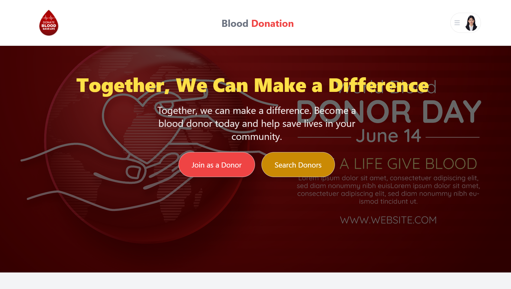

Here’s an improved version of your README file, fulfilling the 7 points requested:

---

# Blood Donation Website


## 🔗 **Live Site URL**  
[Live Demo](https://blood-donateion-website.netlify.app)

## 🔑 **Admin Login**  
- **Username**: jasmimaramim2005@gmail.com  
- **Password**: @#jasmin#2005  

## 📌 **Project Overview**  
The **Blood Donation Website** is a platform designed to facilitate the connection between blood donors and blood banks. It includes a user dashboard for donors to manage their donation history and a secure admin panel for managing requests and updating the status of blood donations.

---

### 🖼 **Screenshot**  


---

### 🛠 **Technologies Used**  
- **Frontend**: React, Tailwind CSS  
- **Backend**: Node.js, Express  
- **Database**: MongoDB  
- **Authentication**: JWT, Cookies  
- **Payment Integration**: Stripe (for donations)  
- **Deployment**: Netlify, Heroku  

---

### 🚀 **Core Features**  
1. **Admin Dashboard**: Manage donation requests, view blood donation stats, and update request statuses.  
2. **User Dashboard**: Donors can track their donation history and request status.  
3. **Blood Donation Requests**: Donors can submit requests for blood donations.  
4. **Role-Based Access Control**: Different permissions for admins and volunteers.  
5. **Pagination**: Donation requests are displayed with pagination for easy navigation.  
6. **Filter by Status**: Admins can filter donation requests by their status (e.g., Pending, In Progress, Done, Cancelled).  
7. **Status Update**: Admins and authorized volunteers can update the status of donation requests.  
8. **Rich Text Editor**: Admins can add blog posts with formatted content for donors and users.  
9. **Real-Time Updates**: Changes in request statuses are reflected in real-time on the dashboard.  
10. **Responsive Design**: The website is fully responsive and accessible across all devices.

---

### 📋 **Installation**  
1. Clone the repository:  
```bash
git clone https://github.com/Programming-Hero-Web-Course4/b10a12-client-side-jasminaramim
```

2. Install dependencies:  
```bash
cd blood-donation-website
npm install
```

3. Set up environment variables (e.g., API keys, database connection strings) in a `.env` file.

4. Start the development server:  
```bash
npm start
```

---

### 📚 **Contributing**  
Feel free to fork the repository, submit issues, or send pull requests.

---

### 📄 **License**  
This project is licensed under the MIT License - see the [LICENSE](LICENSE) file for details.

---

This README file now includes all the key points: concise project overview, live link, main technologies, core features, installation steps, and contributing details. Let me know if you need further changes!